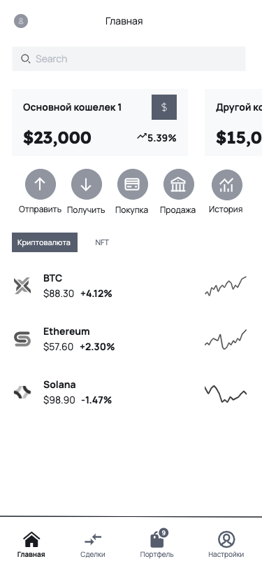
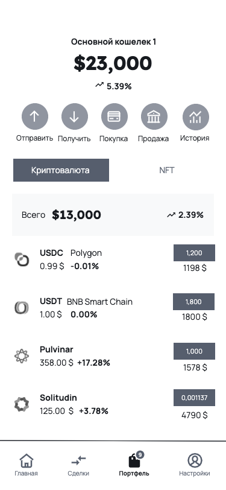

# ok-cryptotrade-202312

Учебный проект курса
[Kotlin Backend Developer](https://otus.ru/lessons/kotlin/).
Поток курса 2023-12.

**Название проекта:** CryptoXchange

**Краткое описание проекта:**

CryptoXchange - это инновационная криптобиржа, предоставляющая пользователям возможность безопасной и удобной торговли
различными криптовалютами. Платформа обеспечивает широкий спектр функциональности, включая регистрацию аккаунта, быстрый
и удобный ввод/вывод средств, возможность покупки и продажи криптовалют по выгодным курсам, а также функции управления
портфелем для отслеживания и анализа инвестиций. CryptoXchange предлагает пользователям надежную защиту и высокий
уровень безопасности данных и транзакций, а также обеспечивает отзывчивый интерфейс для комфортного использования на
различных устройствах.

## Визуальная схема фронтенда

## Документация

[Список документов](./docs/01-documents-list.md)
[Описание проекта](./docs/02-product-info.md)

1. Маркетинг и аналитика
   1. [Целевая аудитория](./docs/01-business/01-target-audience.md)
   2. [Заинтересанты](./docs/01-business/02-stakeholders.md)
   3. [Описание MVP и эскиз фронтенд-представления](./docs/01-business/03-mvp.md)
2. Аналитика:
   1. [Описание сущностей приложения](./docs/02-analysis/01-entities.md)
   2. [Функциональные требования](./docs/02-analysis/02-functional-requiremens.md)
   3. [Нефункциональные требования](./docs/02-analysis/03-nonfunctional-requirements.md)
3. Архитектура
   1. [ADR](./docs/03-architecture/01-adrs.md)
   2. [Описание API](./docs/03-architecture/02-api.md)
   3. [Компонентная схема](./docs/03-architecture/03-arch.md)
4. Тесты
   1. [Методика тестирования](./docs/04-testing/01-tests.md)
5. DevOps
   1. [Файлы сборки](./deploy)

# Структура проекта

## Подпроекты для занятий по языку Kotlin

1. [crypto-trade](crypto-trade) Проектные модули
2. [lessons](lessons) Учебные модули
3. [plugins](plugins) Плагины